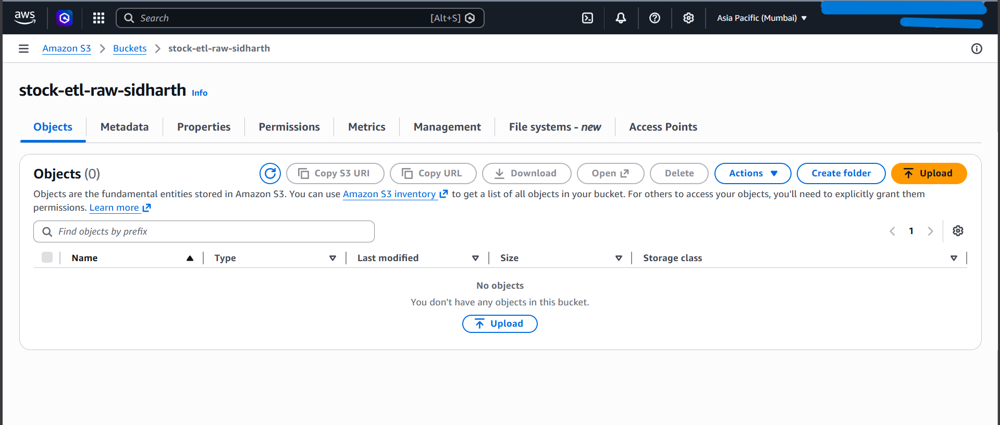

# Stock ETL Pipeline

A production-grade batch ETL pipeline that ingest real Indian stock market data, transforms it using Pandas, stores raw data on AWS S3, and loads analytical results into PostgreSQL.

---

## ARchitecture

```
yfinance API
↓
[Ingestion] → data/raw/ (CSV) → aws s3 (RAW/)
↓
[Load]→ PostgreSQL (enriched_stocks + ticker_summary)
```

---

## Tech Stack

| Layer           | Technology           |
| --------------- | -------------------- |
| Ingestion       | Python, yfinance     |
| Storage         | AWS S3 (Data Lake)   |
| Transformation  | Pandas, Parquet      |
| Load            | PostgreSQL, pyscopg2 |
| Orchestration   | Python               |
| Version Control | Git, GitHub          |

---

## Project Structure

```
stock-etl-pipeline/
├── src/
│   ├── ingestion/
│   │   ├── ingest_stocks.py       # Fetches stock data from yfinance
│   │   └── upload_to_s3.py        # Uploads raw and processed data to S3
│   ├── transform/
│   │   └── transform_stocks.py    # Cleans data and engineers features
│   └── load/
│       └── load_to_postgres.py    # Loads transformed data into PostgreSQL
├── config/
│   └── schema.sql                 # PostgreSQL schema definition
├── data/
│   ├── raw/                       # Raw CSVs (gitignored)
│   └── processed/                 # Parquet and summary CSV (gitignored)
├── logs/                          # Pipeline logs (gitignored)
├── assets/
│   └── s3_bucket.png              # AWS S3 bucket screenshot
├── .env                           # Credentials (gitignored)
├── requirements.txt
└── README.md

---

## Dataset

- **Stocks**: RELIANCE.NS, TCS.NS, INFY.NS, HDFCBANK.NS, WIPRO.NS
- **Source**: Yahoo Finance vis yfinance (free, no API key required)
- **Period**: January 2023 to present
- **Volume**: ~4,180 rows across 5 tickers

---

## Features Engineered

| Feature            | Description                                  |
| ------------------ | -------------------------------------------- |
| `daily_return_pct` | Daiy percentage return vs previous close     |
| `ma_7`             | 7-day rollling moving average of close price |
| `ma_30`            | 30-day rolling moving average of close price |
| `daily_range`      | Intraday price range (high - low)            |

---

##  AWS S3 Data Lake

Raw and processed data is uploaded to AWS S3 using boto3 with IAM credentials
following the principle of least privilege. The bucket uses a two-prefix structure:

- `s3://stock-etl-raw-sidharth/raw/` — Raw CSV files per ticker
- `s3://stock-etl-raw-sidharth/processed/` — Enriched Parquet and summary CSV



---

## PostgreSQL Schema

Two tables are created in the `stockdb` database:

- **enriched_stocks** — Full historical data with engineered features (4,180 rows)
- **ticker_summary** — Aggregated metrics per ticker (5 rows)

Upsert logic (`ON CONFLICT DO UPDATE`) ensures the pipeline is idempotent —
safe to run multiple times without creating duplicates.

---

## How to Run

### 1. Clone the repo
```bash
git clone https://github.com/sidharthramadasan99/stock-etl-pipeline.git
cd stock-etl-pipeline
```

### 2. Set up virtual environment
```bash
python -m venv venv
source venv/Scripts/activate  # Windows Git Bash
pip install -r requirements.txt
```

### 3. Configure environment variables
```bash
cp .env.example .env
# Edit .env with your AWS credentials and PostgreSQL password
```

### 4. Set up PostgreSQL
```bash
psql -U postgres -f config/schema.sql
```

### 5. Run the full pipeline
```bash
python pipeline.py
```

---

## Key Design Decisions

**Why Parquet over CSV for processed data?**
Parquet is a columnar storage format used in every production data lake
(AWS S3, Databricks, Snowflake). It compresses better and reads faster
than CSV for analytical queries.

**Why upsert instead of insert?**
Running `INSERT` on a pipeline that executes daily would create duplicate
rows. `ON CONFLICT DO UPDATE` makes the pipeline idempotent — correct
behavior regardless of how many times it runs.

**Why IAM user instead of root credentials?**
Root AWS credentials have unrestricted access. The IAM user `stock-etl-user`
is granted only `AmazonS3FullAccess` — principle of least privilege.

**Why separate ingestion, transform, and load scripts?**
Separation of concerns. Each stage can be tested, debugged, and rerun
independently without affecting the others.

---

## Author

Built as a portfolio project demonstrating end-to-end Data Engineering skills
acquired during the CDAC PG-DBDA program.